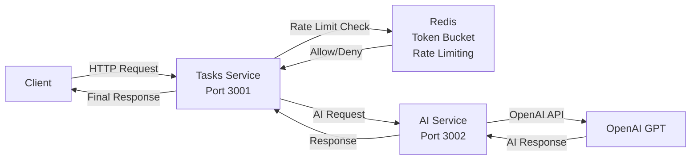

# AI Task Assistant

A microservices-based system that leverages OpenAI to parse natural language task descriptions into structured, actionable data with priority scoring, categorization, and subtask generation.

## Architecture



### Key Architecture Features

- **Generic Capabilities Controller**: The AI service implements a flexible, extensible capability system where new AI capabilities can be added without modifying core controller logic. Each capability defines its own handler, input/output schemas, and validation rules, enabling type-safe, maintainable AI functionality.

## Tech Stack

- **Runtime**: Node.js with TypeScript
- **Framework**: Express.js
- **AI**: OpenAI API
- **Caching/Locking**: Redis with Redlock
- **Containerization**: Docker & Docker Compose
- **Testing**: Vitest (unit, integration, LLM evaluation tests)
- **Validation**: Zod

## Example

### Input

```json
{
  "naturalLanguage": "Prepare quarterly board presentation by next Thursday 2 PM - include Q3 financials, performance metrics, competitive analysis, and Q4 strategy. Critical for budget approval.",
  "config": {
    "categories": ["work", "personal", "health", "finance", "errand"],
    "priorities": {
      "levels": ["low", "medium", "high", "critical"],
      "scores": {
        "low": { "min": 0, "max": 3 },
        "medium": { "min": 4, "max": 6 },
        "high": { "min": 7, "max": 8 },
        "critical": { "min": 9, "max": 10 }
      },
      "overallScoreRange": { "min": 0, "max": 10 }
    }
  }
}
```

### Output

```json
{
  "openaiMetadata": {
    "core": {
      "responseId": "resp_010e5412599d42a70069227a22ef4881928d5239648da81938",
      "tokens": {
        "input": 1017,
        "output": 72
      },
      "durationMs": 2552.31
    },
    "subtasks": {
      "responseId": "resp_0a542afcfb46d5250069227a255160819d86263064feb1c920",
      "tokens": {
        "input": 944,
        "output": 38
      },
      "durationMs": 2281.7
    }
  },
  "result": {
    "title": "Prepare Quarterly Board Presentation",
    "dueDate": "2025-11-27T14:00:00.000Z",
    "category": "work",
    "priority": {
      "level": "critical",
      "score": 10,
      "reason": "Task is critical for budget approval and has a fixed deadline next Thursday 2 PM"
    },
    "subtasks": [
      "Gather Q3 Financial Data",
      "Compile Performance Metrics",
      "Conduct Competitive Analysis",
      "Develop Q4 Strategy",
      "Create Presentation Slides",
      "Review Presentation Content",
      "Finalize And Submit Presentation"
    ]
  },
  "aiServiceRequestId": "d5aacb8b-9721-46b5-8085-6b0a7f0ef753"
}
```

### Input Validation Example

When the input is too vague or ambiguous, the system returns a helpful validation response:

**Input:**

```json
{
  "naturalLanguage": "Plan something soon",
  "config": {
    ...
  }
}
```

**Validation Response (HTTP 400):**

```json
{
  "message": "The input is too vague and generic, lacking a specific task or clear objective to plan.",
  "suggestions": [
    "Specify what exactly you want to plan (e.g., a meeting, a trip, an event).",
    "Provide a timeframe or deadline for the planning.",
    "Clarify the context or category of the plan (work, personal, etc.)."
  ],
  "aiServiceRequestId": "d0c1cc59-4038-46e8-9e41-78b712eb3a63",
  "openaiResponseId": "resp_05c3ee527fe8911f00692285967c6c81a2abe22131a92e7453"
}
```

### OpenAI API Error Example

When the OpenAI API key is invalid or the service is unavailable, the system returns a structured error response with request IDs for debugging:

**Error Response (HTTP 500):**

```json
{
  "message": "Could not execute capability. Please use the request IDs for support.",
  "aiServiceRequestId": "662dbdd5-abb0-499d-bc84-a13bbc06e266",
  "openaiRequestId": "req_39f99c3b9d314136b0b5a69469e068cb"
}
```

## Future Plans

- [ ] **PostgreSQL Integration**: Implement PostgreSQL database with Prisma ORM inside Docker for persistent task storage
- [ ] **Token Usage Rate Limiting**: Add rate limiting based on OpenAI token usage for the "create" endpoint - extract token count from AI response, store in Redis with distributed locking to prevent race conditions
- [ ] **Async AI Processing**: Implement asynchronous support in AI service using RabbitMQ with callback URLs for long-running AI operations
- [ ] **Kubernetes Deployment**: Migrate from Docker Compose to Kubernetes using Minikube for local development

## Getting Started

### Prerequisites

- Docker & Docker Compose
- OpenAI API key

### Setup

1. **Clone the repository**

   ```bash
   git clone <repository-url>
   cd ai-task-assistant
   ```

2. **Configure environment variables**

   For the AI service:

   ```bash
   cd backend/services/ai
   cp .env.example .env.dev
   # Edit .env.dev with your OpenAI API key and configuration
   cp .env.example .env.test
   # Edit .env.test with your OpenAI API key for LLM evaluation tests
   ```

   For the Tasks service:

   ```bash
   cd backend/services/tasks
   cp .env.example .env.dev
   # Edit .env.dev with service configuration
   ```

### Running Locally

Start all services with hot-reload:

```bash
docker-compose -f docker-compose.yml -f docker-compose.dev.yml up --build --watch
```

This will start:

- **Tasks Service** on `http://localhost:3001`
- **AI Service** on `http://localhost:3002`
- **Redis** on `localhost:6379`

### Running Tests

#### AI Service Tests

1. Find the container ID and connect to the running AI container:

   ```bash
   docker ps
   docker exec -it <ai_container_id> sh
   ```

2. Run tests:

   ```bash
   npm run test
   ```

   Or run LLM evaluation tests (requires `.env.test`):

   ```bash
   npm run test:llm
   ```

### Additional Development Commands

#### Type Checking (Watch Mode)

For AI or Tasks service:

```bash
docker ps
docker exec -it <service_container_id> sh
npm run type-check
```

#### Access Redis CLI

```bash
docker ps
docker exec -it <redis_container_id> redis-cli
```

### Shared Library

The `backend/shared` package provides reusable components used across both services:

- **Clients**: Redis, Redlock, HTTP client
- **Middlewares**: Authentication, CORS, error handling, rate limiting, request/response metadata, schema validation
- **Utilities**: Date/time helpers, retry logic, distributed locking, token bucket rate limiter, process event handlers
- **Error Classes**: Custom error types for consistent error handling
- **Types & Schemas**: Shared TypeScript types and Zod schemas

The shared library is built as a separate npm package (`@ai-task-assistant/shared`) and is imported by both services, promoting code reuse and consistency.

#### Shared Library Tests

Run tests for the shared library:

```bash
cd backend/shared
npm run test
```
