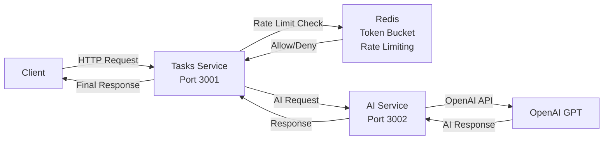

# AI Task Assistant

A microservices-based system that leverages OpenAI to parse natural language task descriptions into structured, actionable data with priority scoring, categorization, and subtask generation.

## Overview

### Architecture



### Key Features

- **Microservices Architecture**: Independent, containerized services that communicate over HTTP
- **Monorepo Code Organization**: NPM Workspaces for simplified dependency management and code sharing
- **Generic Capabilities Controller**: Extensible AI capability system with type-safe handlers
- **Prompt Versioning & Evaluation**: Systematic prompt testing and evaluation framework for AI quality assurance
- **Distributed Rate Limiting**: Token bucket algorithm with Redis and Redlock
- **Type Safety**: TypeScript and Zod schemas throughout the stack

### Tech Stack

- **Runtime**: Node.js with TypeScript
- **Framework**: Express.js
- **AI**: OpenAI API
- **Caching/Locking**: Redis with Redlock
- **Containerization**: Docker & Docker Compose
- **Monorepo**: NPM Workspaces
- **Testing**: Vitest (unit, integration, prompt versioning and evaluation)
- **Validation**: Zod

## Getting Started

### Prerequisites

- Docker & Docker Compose
- OpenAI API key

### Quick Start

1. **Clone the repository**

   ```bash
   git clone <repository-url>
   cd ai-task-assistant
   ```

2. **Install dependencies**

   ```bash
   npm install
   ```

3. **Configure environment variables**

   ```bash
   # AI Service
   cd backend/services/ai
   cp .env.example .env.dev
   # Edit .env.dev with your OpenAI API key
   cp .env.example .env.test
   # Edit .env.test with your OpenAI API key for prompt evaluation tests

   # Tasks Service
   cd backend/services/tasks
   cp .env.example .env.dev
   # Edit .env.dev with service configuration
   ```

4. **Start services**

   ```bash
   docker-compose -f docker-compose.yml -f docker-compose.dev.yml up --build --watch
   ```

   Services will be available at:

   - **Tasks Service**: `http://localhost:3001`
   - **AI Service**: `http://localhost:3002`
   - **Redis**: `localhost:6379`

### Additional Commands

```bash
# Type checking (inside container)
docker exec -it <container_id> sh
npm run type-check

# Access Redis CLI
docker exec -it <redis_container_id> redis-cli

# View logs
docker-compose -f docker-compose.yml -f docker-compose.dev.yml logs -f ai
docker-compose -f docker-compose.yml -f docker-compose.dev.yml logs -f tasks
```

### Running Tests

```bash
# Run all tests
npm test

# Run prompt evaluation tests (requires .env.test)
npm run test:prompts

# Run tests for specific workspace
npm test -w backend/services/ai
npm test -w backend/services/tasks
npm test -w backend/shared
```

## API Examples

> **Note**: The examples below show both current and planned API responses. As part of planned improvements (see Future Plans), the Tasks service will return cleaner responses: only the parsed task data on success (200), validation messages without internal IDs (400), and user-friendly error messages (500). Technical metadata and request IDs will be kept in server logs for debugging and monitoring.

### Task Parsing

**Request:**

```json
{
  "naturalLanguage": "Prepare quarterly board presentation by next Thursday 2 PM - include Q3 financials, performance metrics, competitive analysis, and Q4 strategy. Critical for budget approval.",
  "config": {
    "categories": ["work", "personal", "health", "finance", "errand"],
    "priorities": {
      "levels": ["low", "medium", "high", "critical"],
      "scores": {
        "low": { "min": 0, "max": 3 },
        "medium": { "min": 4, "max": 6 },
        "high": { "min": 7, "max": 8 },
        "critical": { "min": 9, "max": 10 }
      },
      "overallScoreRange": { "min": 0, "max": 10 }
    }
  }
}
```

**Response (Current):**

```json
{
  "openaiMetadata": {
    "core": {
      "responseId": "resp_010e5412599d42a70069227a22ef4881928d5239648da81938",
      "tokens": { "input": 1017, "output": 72 },
      "durationMs": 2552.31
    },
    "subtasks": {
      "responseId": "resp_0a542afcfb46d5250069227a225160819d86263064feb1c920",
      "tokens": { "input": 944, "output": 38 },
      "durationMs": 2281.7
    }
  },
  "result": {
    "title": "Prepare Quarterly Board Presentation",
    "dueDate": "2025-11-27T14:00:00.000Z",
    "category": "work",
    "priority": {
      "level": "critical",
      "score": 10,
      "reason": "Task is critical for budget approval and has a fixed deadline next Thursday 2 PM"
    },
    "subtasks": [
      "Gather Q3 Financial Data",
      "Compile Performance Metrics",
      "Conduct Competitive Analysis",
      "Develop Q4 Strategy",
      "Create Presentation Slides",
      "Review Presentation Content",
      "Finalize And Submit Presentation"
    ]
  },
  "aiServiceRequestId": "d5aacb8b-9721-46b5-8085-6b0a7f0ef753"
}
```

**Response (Planned - cleaner format):**

```json
{
  "title": "Prepare Quarterly Board Presentation",
  "dueDate": "2025-11-27T14:00:00.000Z",
  "category": "work",
  "priority": {
    "level": "critical",
    "score": 10,
    "reason": "Task is critical for budget approval and has a fixed deadline next Thursday 2 PM"
  },
  "subtasks": [
    "Gather Q3 Financial Data",
    "Compile Performance Metrics",
    "Conduct Competitive Analysis",
    "Develop Q4 Strategy",
    "Create Presentation Slides",
    "Review Presentation Content",
    "Finalize And Submit Presentation"
  ]
}
```

### Input Validation

When input is too vague, the system provides helpful suggestions:

**Request:**

```json
{
  "naturalLanguage": "Plan something soon",
  "config": { ... }
}
```

**Response (HTTP 400 - Current):**

```json
{
  "message": "The input is too vague and generic, lacking a specific task or clear objective to plan.",
  "suggestions": [
    "Specify what exactly you want to plan (e.g., a meeting, a trip, an event).",
    "Provide a timeframe or deadline for the planning.",
    "Clarify the context or category of the plan (work, personal, etc.)."
  ],
  "aiServiceRequestId": "d0c1cc59-4038-46e8-9e41-78b712eb3a63",
  "openaiResponseId": "resp_05c3ee527fe8911f00692285967c6c81a2abe22131a92e7453"
}
```

**Response (HTTP 400 - Planned):**

```json
{
  "message": "The input is too vague and generic, lacking a specific task or clear objective to plan.",
  "suggestions": [
    "Specify what exactly you want to plan (e.g., a meeting, a trip, an event).",
    "Provide a timeframe or deadline for the planning.",
    "Clarify the context or category of the plan (work, personal, etc.)."
  ]
}
```

### Error Handling

When the OpenAI API encounters an error, the system returns a structured error response:

**Response (HTTP 500 - Current):**

```json
{
  "message": "Could not execute capability. Please use the request IDs for support.",
  "aiServiceRequestId": "662dbdd5-abb0-499d-bc84-a13bbc06e266",
  "openaiRequestId": "req_39f99c3b9d314136b0b5a69469e068cb"
}
```

**Response (HTTP 500 - Planned):**

```json
{
  "message": "An unexpected error occurred while processing your request. Please try again later."
}
```

## Shared Library

The `backend/shared` package provides reusable components:

- **Clients**: Redis, Redlock, HTTP client
- **Middlewares**: Authentication, CORS, error handling, rate limiting, schema validation
- **Utilities**: Date/time helpers, retry logic, distributed locking, token bucket rate limiter
- **Error Classes**: Custom error types for consistent error handling
- **Types & Schemas**: Shared TypeScript types and Zod schemas

## Future Plans

### Near-Term Enhancements

1. **Improve Tasks Service Response Format**

   - Return only the parsed task data on success (remove OpenAI metadata from response)
   - Return validation message with suggestions for vague inputs (HTTP 400)
   - Return clean error messages for unexpected errors (HTTP 500)
   - Keep OpenAI metadata in logs for debugging and monitoring

2. **Add Tasks Service Tests**

   - Unit and Integration tests for controller logic
   - Test rate limiting behavior

3. **PostgreSQL Integration**

   - Add PostgreSQL service to Docker Compose
   - Implement Prisma ORM with schema and migrations
   - Create CRUD operations for tasks in Tasks service

4. **Token Usage Rate Limiting**

   - Implement rate limiting on `/tasks` create route based on OpenAI token usage
   - Track token consumption per request using AI service response metadata
   - Store token usage in Redis with distributed locking (Redlock) to prevent race conditions
   - Configure per-user token limits (e.g., 10,000 tokens per hour)

5. **Async AI Processing**
   - Add message queue (RabbitMQ) to infrastructure
   - Implement async job processing for AI requests
   - Return job ID immediately
   - Support webhook notifications when processing completes
