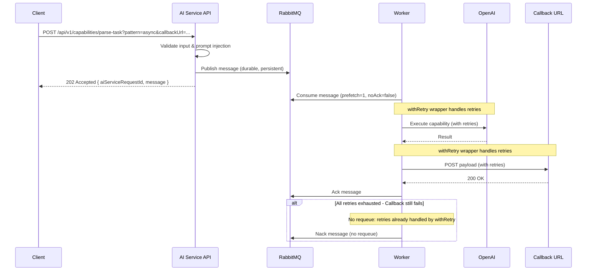

# Async AI Processing with RabbitMQ

## Overview

Implement async AI processing capability alongside the existing sync pattern. When `pattern=async` is used with a `callbackUrl`, requests are published to RabbitMQ and return immediately with 202 Accepted. Workers process messages from the queue and send results to the callback URL. Uses manual acknowledgment - only ack after successful callback delivery.

## Implementation Process

**Important**: After completing each section and running verification steps (`npm run test` and `npm run type-check:ci`), **wait for user approval before proceeding** to the next section. This ensures each phase is reviewed and approved before continuing.

## Architecture Flow



## Implementation Steps

### 1. Infrastructure Setup

**Add RabbitMQ to Docker Compose**

- Add `rabbitmq` service to `docker-compose.yml` and `docker-compose.dev.yml`
- Use official `rabbitmq:3-management` image
- Expose ports 5672 (AMQP) and 15672 (management UI)
- Add volume for data persistence

**Add Dependencies**

- Add `amqplib` and `@types/amqplib` to `backend/shared/package.json`

**Verification Step**

- Run `npm run test` from root to ensure no test regressions
- Run `npm run type-check:ci` from root to ensure no type errors
- **Wait for user approval before proceeding to Section 2**

### 2. RabbitMQ Client & Configuration

**Create RabbitMQ Client** (`backend/shared/src/clients/rabbitmq/rabbitmq.ts`)

- Connection management with async/await (following amqplib async patterns)
- Connection retry logic for startup using `withRetry` wrapper
- Error event handling for runtime connection issues
- Export connection utilities only (channel and queue operations handled in service layer)

**Environment Configuration**

- Add `RABBITMQ_URL` to `backend/services/ai/src/config/env.ts` (validated as URL using `url()` validator)
- Reference `RABBITMQ_DEFAULT_USER` and `RABBITMQ_DEFAULT_PASSWORD` in `docker-compose.yml` for RabbitMQ service
- `RABBITMQ_QUEUE_NAME` will be defined as a constant (not an environment variable)

**Verification Step**

- Run `npm run test` from root to ensure RabbitMQ client tests pass
- Run `npm run type-check:ci` from root to ensure no type errors
- **Wait for user approval before proceeding to Section 3**

### 3. Type Definitions & Schema Updates

**Update Express Types** (`backend/services/ai/src/types/express.d.ts`)

- Remove `capabilityPattern?: CapabilityPattern` (no longer needed)
- Add `capabilityValidatedQuery` with discriminated union type inferred from schema:
  ```typescript
  capabilityValidatedQuery?: z.infer<
    typeof executeCapabilityInputSchema
  >["query"];
  ```
- Type is automatically inferred from schema, ensuring single source of truth

**Update Query Schema** (`backend/services/ai/src/schemas/execute-capability.ts`)

- Convert query to discriminated union using `z.discriminatedUnion("pattern", [...])`:
  - `sync` pattern: only `pattern` required
  - `async` pattern: both `pattern` and `callbackUrl` required (validated as URL)
- Schema validates `callbackUrl` is a valid URL for async pattern

**Update Middleware** (`backend/services/ai/src/middlewares/validate-executable-capability/validate-executable-capability.ts`)

- Remove setting of `capabilityPattern` in `res.locals`
- Store validated query in `res.locals.capabilityValidatedQuery`
- The validated query is directly assigned (no type assertions needed)

**Update Utility** (`backend/services/ai/src/utils/get-capability-validated-query/get-capability-validated-query.ts`)

- Refactored from `getCapabilityPattern` to `getCapabilityValidatedQuery`
- Returns the full validated query object (discriminated union) instead of just the pattern
- Type-safe access to the full query object, allowing access to `callbackUrl` for async pattern

**Verification Step**

- Run `npm run test` from root to ensure schema and middleware tests pass
- Run `npm run type-check:ci` from root to ensure no type errors
- **Wait for user approval before proceeding to Section 4**

### 4. Async Pattern Executor

**Create Async Executor** (`backend/services/ai/src/controllers/capabilities-controller/executors/execute-async-pattern/execute-async-pattern.ts`)

- Accept `callbackUrl` as parameter (passed from controller)
- Use AI service RabbitMQ client (`sendMessageToRabbitMQQueue`) to publish message
- Publish message to RabbitMQ queue with:
  - `requestId` (from parameter)
  - `capability` name (from config)
  - `input` (validated input)
  - `callbackUrl` (from parameter)
- Message properties: `persistent: true` (handled by client)
- Return `{ message: "The request has been received and will be executed shortly." }`

**Create AI Service RabbitMQ Client** (`backend/services/ai/src/clients/rabbitmq/rabbitmq.ts`)

- Wraps shared RabbitMQ client connection
- Provides `connectRabbitMQClient()` and `closeRabbitMQClient()` for connection management
- Provides `getRabbitMQChannel()` that creates channel and asserts queue (durable: true)
- Provides `sendMessageToRabbitMQQueue()` for type-safe message publishing using `QueueToMessageDataMap`

**Update Controller** (`backend/services/ai/src/controllers/capabilities-controller/capabilities-controller.ts`)

- Use `getCapabilityValidatedQuery` instead of `getCapabilityPattern`
- Extract pattern from `validatedQuery.pattern` (discriminated union ensures type safety)
- Directly call `executeSyncPattern` or `executeAsyncPattern` based on pattern (no get-pattern-executor utility)
- Return 202 Accepted for async pattern instead of 200 OK

**Create Message Data Schema** (`backend/services/ai/src/schemas/capabilities-queue-message-data.ts`)

- Define Zod schema for queue message data: `{ requestId: string, capability: Capability, input: unknown, callbackUrl: string }`
- Export type inferred from schema
- Create queue-to-message-data mapping type for type-safe queue operations

**Verification Step**

- Run `npm run test` from root to ensure async executor and controller tests pass
- Run `npm run type-check:ci` from root to ensure no type errors
- **Wait for user approval before proceeding to Section 5**

### 5. Worker Service

**Create Worker** (`backend/services/ai/src/workers/capability-worker/capability-worker.ts`)

- Connect to RabbitMQ using shared client
- Create channel and assert queue (durable: true)
- Set `prefetch(1)` for fair dispatch
- Consume queue with `noAck: false` (manual acknowledgment)
- For each message:

  1. Parse message payload using Zod schema defined inline in worker:
     - Define message schema: `{ requestId: string, capability: Capability, input: unknown, callbackUrl: string }`
     - Validate and parse message content
  2. Get capability config from `capabilities` registry (import from `@capabilities`)
  3. Execute using `executeSyncPattern` (import from `@controllers/capabilities-controller/executors/execute-sync-pattern`, reuses existing executor logic with schema validation)
  4. Format callback payload using Zod schema defined inline:
     - Success schema: `{ success: z.literal(true), data: { openaiMetadata, result, aiServiceRequestId } }`
     - Error schema: `{ success: z.literal(false), error: { message: string, statusCode: number, context?: Record<string, unknown> } }`
  5. POST to callbackUrl with `withRetry` wrapper (using DEFAULT_RETRY_CONFIG from shared)
  6. On successful callback: `channel.ack(msg)`
  7. On callback failure: `channel.nack(msg, false, false)` (no requeue - retries already handled)

**Error Handling in Worker**

- Catch errors from `executeSyncPattern` execution
- Extract error context:
  - For vague input errors: extract `openaiMetadata` from error if available
  - For other errors: extract error message, statusCode, and any additional context
- Format error payload: `{ success: false, error: { message, statusCode, ...context } }`
- Always attempt callback delivery (even for errors) using `withRetry`
- Only ack after successful callback delivery
- On callback failure after all retries: nack without requeue (retries already handled at OpenAI and callback levels)

**Worker Entry Point** (`backend/services/ai/src/workers/capability-worker/index.ts`)

- Initialize worker and start consuming
- Handle graceful shutdown

### 6. Server Integration

**Update Server** (`backend/services/ai/src/server.ts`)

- Start worker alongside API server
- Handle graceful shutdown for both API and worker

**Verification Step**

- Run `npm run test` from root to ensure worker tests pass
- Run `npm run type-check:ci` from root to ensure no type errors
- **Wait for user approval before proceeding to Section 7**

### 7. Testing

**Update Existing Tests**

1. **`capabilities-controller.unit.test.ts`**

   - Add test for async pattern: should return 202 Accepted with `{ aiServiceRequestId, message }`
   - Add test: should call async executor for async pattern
   - Update existing test to verify sync returns 200 OK

3. **`validate-executable-capability.test.ts`**
   - Test: should store capabilityValidatedQuery with sync pattern (only pattern field)
   - Test: should store capabilityValidatedQuery with async pattern (pattern and callbackUrl)
   - Test: should validate callbackUrl is a valid URL for async pattern
   - Test: should reject async pattern without callbackUrl

**Create New Unit Tests**

1. **`execute-async-pattern.test.ts`**

   - Test: should publish message to RabbitMQ with correct payload
   - Test: should use persistent message properties
   - Test: should return correct response format
   - Test: should handle RabbitMQ publish errors
   - Use `vi.mock()` for RabbitMQ client
   - Use mock factory from `@shared/mocks/rabbitmq-mock`

2. **`capability-worker.test.ts`**

   - Test: should consume messages from queue
   - Test: should create channel and assert queue (durable: true)
   - Test: should set prefetch(1)
   - Test: should parse message payload using inline Zod schema
   - Test: should use executeSyncPattern for execution
   - Test: should format success callback payload using inline Zod schema
   - Test: should format error callback payload with context using inline Zod schema
   - Test: should call callback URL with withRetry
   - Test: should ack message on successful callback
   - Test: should nack without requeue on callback failure after retries
   - Test: should handle capability execution errors
   - Test: should extract error context (openaiMetadata for vague input)
   - Use `vi.mock()` for RabbitMQ client, capabilities, executeSyncPattern, withRetry
   - Use mock factories and mock values

3. **`rabbitmq.test.ts`** (in shared) ✅
   - Test: should create connection with retry logic
   - Test: should set up error event handler on connection
   - Test: should use withRetry for connection retry logic
   - Test: should propagate connection errors through withRetry
   - Test: should close connection gracefully
   - Test: should throw error if close operation fails
   - Use `vi.mock()` for amqplib and withRetry

4. **`rabbitmq.test.ts`** (in AI service) ✅
   - Test: should create RabbitMQ connection
   - Test: should store connection globally
   - Test: should close channel and connection
   - Test: should close connection even when channel is not created
   - Test: should handle case when connection is not initialized
   - Test: should return connection when initialized
   - Test: should throw error when connection is not initialized
   - Test: should create channel and assert queue
   - Test: should reuse existing channel on subsequent calls
   - Test: should assert queue with durable option
   - Test: should send message to queue with correct payload
   - Test: should use persistent message properties
   - Test: should serialize message data to JSON buffer
   - Use `vi.mock()` for shared RabbitMQ client and env config

**Create Mock Files**

1. **`backend/shared/src/mocks/rabbitmq-mock.ts`**

   - Export `createRabbitMQConnectionMock()` - Returns mock connection (amqp.ChannelModel)
   - Follow pattern from other mock factories (logger-mock, redis-mock)
   - Note: Channel and message mocks can be created inline in tests as needed

**Test Structure Guidelines**

- Use `Mocked<T>` from `@shared/types` for typed mocks
- Use `vi.clearAllMocks()` in `afterEach` only when mocks are used
- Follow Arrange-Act-Assert pattern
- Use `expect.any(String)` for dynamic values (requestId)
- Use `expect.objectContaining()` for partial object matching
- Test both success and error paths
- Verify error messages don't leak sensitive data

**Final Verification Step**

- Run `npm run test` from root to ensure all tests pass
- Run `npm run type-check:ci` from root to ensure all types are correct
- Fix any failing tests or type errors before proceeding
- **Wait for user approval before considering implementation complete**

## Files to Create

1. `backend/shared/src/clients/rabbitmq/rabbitmq.ts` - RabbitMQ connection management (connection only) ✅
2. `backend/shared/src/clients/rabbitmq/index.ts` - Export ✅
3. `backend/services/ai/src/clients/rabbitmq/rabbitmq.ts` - AI service RabbitMQ client wrapper (channel and queue operations) ✅
4. `backend/services/ai/src/clients/rabbitmq/index.ts` - Export ✅
4. `backend/services/ai/src/controllers/capabilities-controller/executors/execute-async-pattern/execute-async-pattern.ts` - Async executor ✅
5. `backend/services/ai/src/controllers/capabilities-controller/executors/execute-async-pattern/index.ts` - Export ✅
6. `backend/services/ai/src/schemas/capabilities-queue-message-data.ts` - Queue message data schema ✅
7. `backend/services/ai/src/types/capabilities-queue-message-data.ts` - Queue message data type ✅
8. `backend/services/ai/src/types/rabbitmq-queue.ts` - RabbitMQ queue type ✅
9. `backend/services/ai/src/types/queue-to-message-data-map.ts` - Queue to message data mapping type ✅
10. `backend/services/ai/src/constants/rabbitmq-queue.ts` - RabbitMQ queue constants ✅
11. `backend/services/ai/src/workers/capability-worker/capability-worker.ts` - Worker logic (defines message and callback payload schemas inline) ⏳
12. `backend/services/ai/src/workers/capability-worker/index.ts` - Worker entry point ⏳
13. `backend/shared/src/mocks/rabbitmq-mock.ts` - RabbitMQ connection mock factory ⏳
14. `backend/services/ai/src/controllers/capabilities-controller/executors/execute-async-pattern/execute-async-pattern.test.ts` - Unit tests for async executor ✅
15. `backend/services/ai/src/workers/capability-worker/capability-worker.test.ts` - Unit tests for worker ⏳
16. `backend/shared/src/clients/rabbitmq/rabbitmq.test.ts` - Unit tests for shared RabbitMQ client ✅
17. `backend/services/ai/src/clients/rabbitmq/rabbitmq.test.ts` - Unit tests for AI service RabbitMQ client ✅

## Files to Modify

1. `docker-compose.yml` - Add RabbitMQ service with env vars from root .env ✅
2. `backend/shared/package.json` - Add amqplib and @types/amqplib dependencies ✅
3. `backend/services/ai/src/config/env.ts` - Add RABBITMQ_URL validation (url() validator) ✅
4. `backend/services/ai/src/types/express.d.ts` - Add capabilityValidatedQuery with discriminated union (inferred from schema), remove capabilityPattern ✅
5. `backend/services/ai/src/schemas/execute-capability.ts` - Discriminated union for query params (sync vs async with callbackUrl) ✅
6. `backend/services/ai/src/middlewares/validate-executable-capability/validate-executable-capability.ts` - Store capabilityValidatedQuery in res.locals ✅
7. `backend/services/ai/src/utils/get-capability-validated-query/get-capability-validated-query.ts` - Refactored from getCapabilityPattern, returns full validated query object ✅
8. `backend/services/ai/src/controllers/capabilities-controller/capabilities-controller.ts` - Return 202 for async, use getCapabilityValidatedQuery and extract pattern from validatedQuery.pattern, directly call executors ✅
9. `backend/services/ai/src/server.ts` - Connect to RabbitMQ on startup, close on shutdown ⏳ (worker not yet started)
10. `backend/services/ai/src/controllers/capabilities-controller/capabilities-controller.unit.test.ts` - Add async pattern tests (202 status), update to use getCapabilityValidatedQuery ✅
11. `backend/services/ai/src/middlewares/validate-executable-capability/validate-executable-capability.test.ts` - Update tests for capabilityValidatedQuery ✅
12. `backend/services/ai/src/utils/get-capability-validated-query/get-capability-validated-query.test.ts` - Tests for getCapabilityValidatedQuery utility ✅

## Key Implementation Details

- **Queue Configuration**: Durable queue, persistent messages, prefetch=1
- **Acknowledgment**: Manual ack only after successful callback delivery
- **Error Handling**: Nack without requeue on callback failure (retries already handled at OpenAI and callback levels via withRetry)
- **No Redis**: Message state not stored, only in RabbitMQ messages
- **RequestId**: Reuse existing `requestId` from middleware, no messageId generation
- **Shared Client**: RabbitMQ connection management in `backend/shared` (connection only)
- **AI Service Client**: Wrapper in `backend/services/ai/src/clients/rabbitmq.ts` provides channel and queue operations with type-safe message publishing
- **Environment**: Only `RABBITMQ_URL` in AI service env.ts (validated as URL), queue name as constant
- **Type Safety**: `capabilityValidatedQuery` uses discriminated union inferred from schema (single source of truth)
- **Schema-First**: Types inferred from Zod schemas, ensuring runtime validation matches TypeScript types
- **Inline Types**: Message and callback payload types defined inline in worker using Zod (not separate type files)
- **Verification**: Run `npm run test` and `npm run type-check:ci` after each major section to catch issues early
- **Approval Process**: Wait for user approval after completing each section and verification before proceeding to the next section
